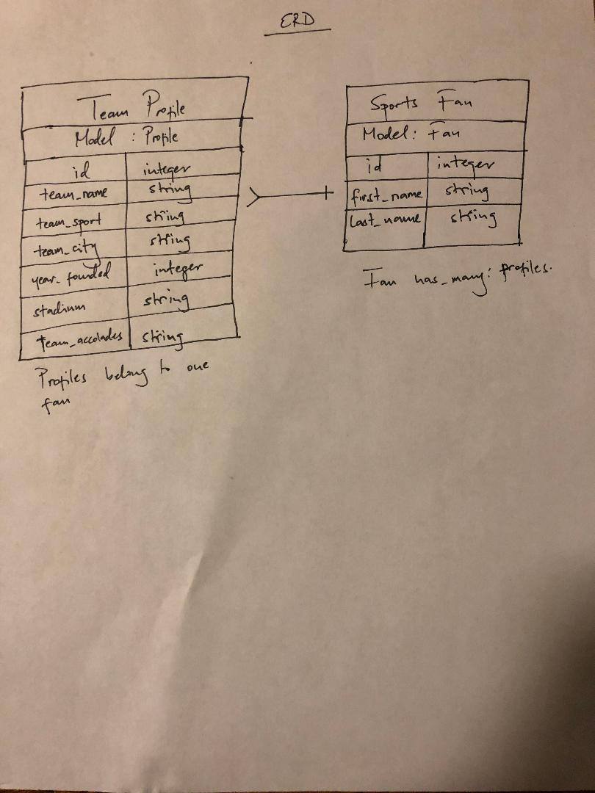

## General Assembly SEI Project 2 (Full-stack-project)

## Planning story
The goal of this project is to build a full stack application, whereby there is a one many relationship resource table in the backend. The idea is to have a user would be able to create an account using the authorization forms, get into the website and create, update, delete and see all created items within their account. The user should also not be able to log into their and be able CRUD in anyone else's account.

#### Breaking down the challange
I started the process by deciding what application would be, then working out what the relationship structure would be in the background. From there, I came up with the columns that would be included in each table to scaffolded. Once that was done, it was a matter of connecting the backend to an api and creating the CRUD actions that my users would have access to in thier accounts then using curl script to test each one for proper functionality since the front-end wasn't up and running.

### USER STORIES
- As a fan, I would like to be able to sign-up within a few clicks
- As a fan, I would like to be able to sign-in within a few clicks
- As a fan, I would like to be able to sign-out within a few clicks
- As a fan, I would like to be able to change-password within a few clicks
- As a fan, I want to be able to look up team's entire profile without clicking
  in too many places.
- As a fan, I would like to be able to add my teams by entering data
- As a fan, I would like to be able to edit any data for teams that I added
- As a fan, I would like to be able to delete any data for teams that I added
    by simply selecting and deleting with one button
- As a fan, I would like to see all my teams.

## Technology used

- jQuery
- HTML
- Javascript
- Heroku
- Ruby
- Ruby on rails
- Github

## Links

[Deployed FrontEnd Client](https://mwwasswa.github.io/project_2_client/)

[FrontEnd repo](https://github.com/mwwasswa/project_2_client)

[Deployed BackEnd API](https://thebadlands.herokuapp.com/)

## ERD

## Would like to add
- I would like to build a joins table so that a user can compare different teams in the league
- I would like to see historical stats for the craeted teams, game won, games lost and whoever they played
- I would like to have teams profiles across multiple types of sports
